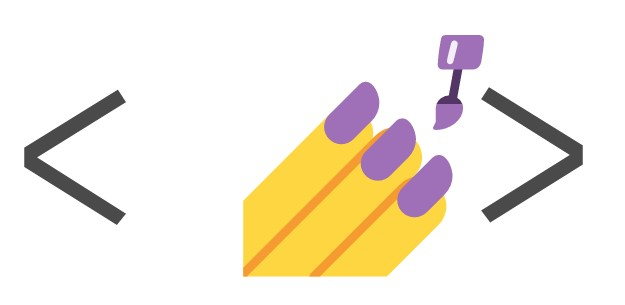

<h1>Hi! I'm May 👋</h1>

<h2>Frontend/Full Stack Developer </h2>

 I love to build and program projects, from the idea to the finished product.

&nbsp;

&nbsp;
<a href="https://may-portfolio.netlify.app/" target="_blank">
<button name='button' style="background-color:#F21D56;border:none;color:white;padding:6px;border-radius:8px;">Check out my work
</button>
</a>
&nbsp;

 
 

<h3>💞️ My skills</h3>

&nbsp;

&nbsp;

&nbsp;

&nbsp;

&nbsp;

&nbsp;

&nbsp;

&nbsp;

&nbsp;

&nbsp;

&nbsp;

 
 

<h3>💞️ What I am currently learnings</h3>

&nbsp;

&nbsp;

 
 

<h3>Do not be a stranger, contact me :)</h3>

\*\*icons from font Awesome.com

